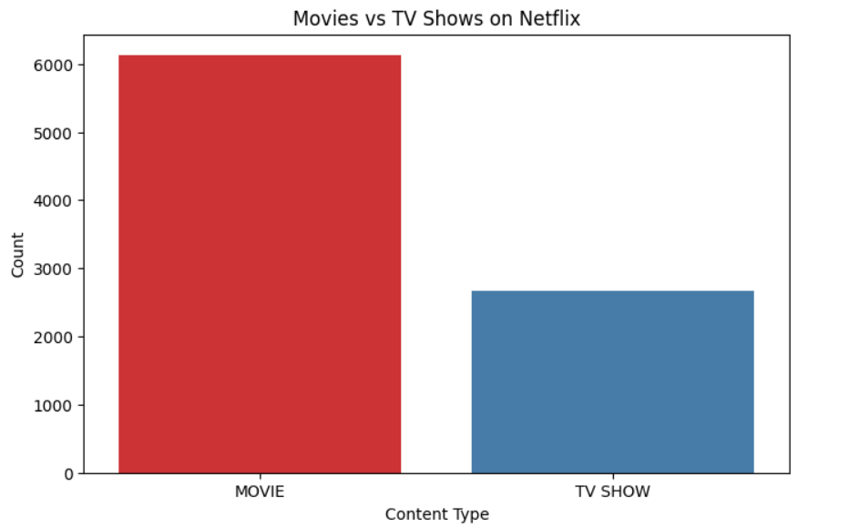
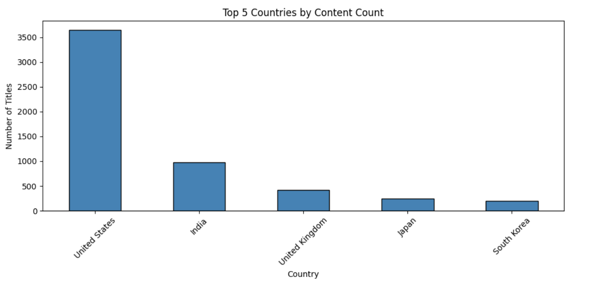
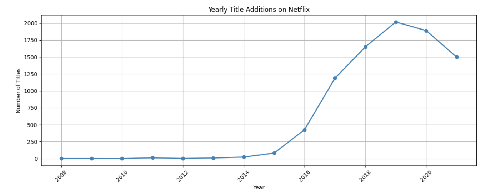
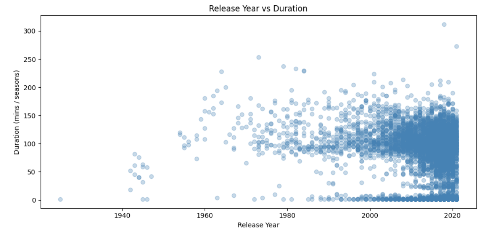
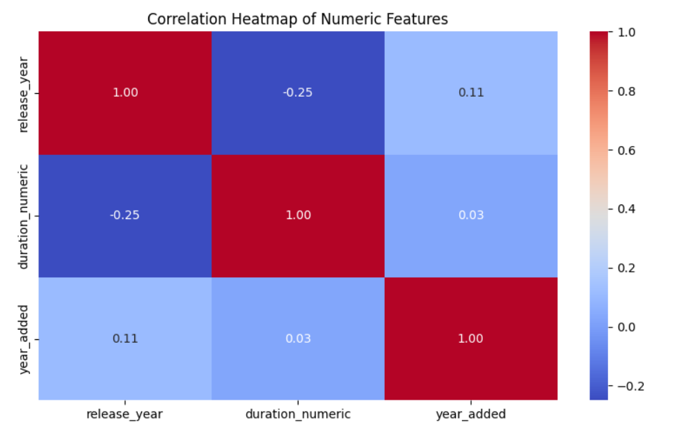

# 🎬 Netflix Content Analysis


---

## 📌 Problem Statement

Netflix is one of the world's leading streaming platforms with thousands of titles across movies and TV shows. Understanding the content distribution, growth trends, and regional patterns can help Netflix make data-driven decisions around content strategy, regional expansion, and audience targeting. This project analyzes Netflix's titles dataset of 8,807 entries to uncover content trends, country-wise distribution, growth patterns, and audience rating preferences.

---

## 📂 Dataset

- **Source:** [Netflix Movies and TV Shows — Kaggle](https://www.kaggle.com/datasets/shivamb/netflix-shows)
- **Rows:** 8,807 titles
- **Columns:** 12 features
- **Key Columns:** `type`, `title`, `country`, `date_added`, `release_year`, `rating`, `duration`, `listed_in`

---

## 🛠 Tech Stack

- Python
- Pandas
- NumPy
- Matplotlib
- Seaborn
- Google Colab

---

## 📁 Folder Structure

```
Netflix_Content_Analysis/
│
├── Netflix Content Analysis.ipynb
├── README.md
├── netflix_titles.csv
├── plot1_movies_vs_tvshows.png
├── plot2_top5_countries.png
├── plot3_yearly_additions.png
├── plot4_release_year_vs_duration.png
└── plot5_correlation_heatmap.png
```

---

## 💡 Key Insights

- 🎥 **Movies dominate** Netflix with **69.6% (6,131 titles)** vs TV Shows at **30.4% (2,676 titles)**
- 🌍 **United States leads** content production with **2,818 titles**, followed by India (972) and United Kingdom (419)
- 📅 **Peak content additions** were in **2019 with 2,016 titles**, showing Netflix's aggressive content push
- 🔞 **TV-MA is the most common rating** with 3,207 titles, indicating Netflix's primary focus on mature audiences
- 📈 **Netflix grew rapidly** from just 24 titles added in 2014 to over 2,000 in 2019 — a **83x growth in 5 years**
- 🌏 **India ranks 2nd globally** in content volume, highlighting the importance of regional content strategy
- 📺 **TV Shows are newer** with an average release year of 2017 vs Movies at 2013
- 🧹 **Data cleaning performed** — dropped `director` column (2,634 missing values), filled missing `cast`, `country`, `date_added`, and `rating` with mode/placeholder values

---

## 📊 Visualizations

### Plot 1 — Movies vs TV Shows on Netflix


### Plot 2 — Top 5 Countries by Content Count


### Plot 3 — Yearly Title Additions on Netflix


### Plot 4 — Release Year vs Duration


### Plot 5 — Correlation Heatmap of Numeric Features


---

## ▶️ How to Run

1. Clone the repo
```bash
git clone https://github.com/nishhh2004/Netflix_Content_Analysis.git
```

2. Install libraries
```bash
pip install pandas numpy matplotlib seaborn
```

3. Download dataset from Kaggle and rename it as `netflix_titles.csv`

4. Open `Netflix_Content_Analysis.ipynb` in Jupyter or Google Colab and run all cells

---

## 📋 Summary Scorecard

| Metric | Value |
|---|---|
| Total Titles | 8,807 |
| Movies | 6,131 (69.6%) |
| TV Shows | 2,676 (30.4%) |
| Top Country | United States (2,818 titles) |
| Most Common Rating | TV-MA (3,207 titles) |
| Peak Year (Additions) | 2019 (2,016 titles) |
| Earliest Content | 1925 |
| Latest Content | 2021 |
| Avg Movie Release Year | 2013 |
| Avg TV Show Release Year | 2017 |

---

## ✅ Netflix Content Strategy Recommendations

- **Invest more in TV Shows** — at only 30% of the catalogue, there is a clear gap and opportunity for growth
- **Expand regional content** — India already ranks 2nd; further investment in Indian, Japanese and Korean originals can grow subscriber retention
- **Focus on TV-MA and TV-14 content** — these two ratings account for the majority of viewership
- **Leverage 2019 peak momentum** — content additions slowed after 2020 (likely COVID impact); re-accelerating in these categories will be key
- **Shorter format content** — data shows growing preference for shorter movies and limited series which reduces production cost while maintaining engagement
